# Escape from Darklight

<p align="center">
  
</p>

<p align="center">
Escape from Darklight는 어둠 속에서 빛의 범위 안을 탐색하며 출구를 찾아 탈출하는 iOS 미로 게임 어플리케이션입니다. <br />
제한된 시야와 햅틱 피드백을 활용해 장애물을 피하고, 다양한 장치를 작동시켜 스테이지를 클리어할 수 있습니다.
</p>

[🍎 App Store에서 다운로드하기](https://apps.apple.com/kr/app/escape-from-darklight/id6754834675)

<br />
<br />

# 목차

- [리포지토리 구조](#리포지토리-구조)
- [기술 스택](#기술-스택)
  - [클라이언트](#클라이언트)
    - [왜 Expo인가?](#왜-expo인가)
  - [API 서버](#api-서버)
- [핵심 기능](#핵심-기능)
  - [시야 제한 & 조명 시스템](#시야-제한--조명-시스템)
  - [출구 힌트 & 진동 피드백 시스템](#출구-힌트--진동-피드백-시스템)
  - [스테이지 상호작용 시스템](#스테이지-상호작용-시스템)
- [챌린지](#챌린지)
  - [1. JSON으로 된 맵이 어떻게 실제 게임으로 바뀔까?](#1-json으로-된-맵이-어떻게-실제-게임으로-바뀔까)
    - [1-1. 맵 데이터를 JSON으로 분리한 이유](#1-1-맵-데이터를-JSON으로-분리한-이유)
    - [1-2. JSON이 실제 게임 월드로 변환되는 과정](#1-2-json이-실제-게임-월드로-변환되는-과정)
  - [2. React Native에서 어떻게 게임 엔진을 구현할까?](#2-react-native에서-어떻게-게임-엔진을-구현할까)
    - [2-1. React와 게임 루프의 구조적 차이](#2-1-React와-게임-루프의-구조적-차이)
    - [2-2. 게임 루프를 위한 상태 관리와 렌더링의 분리](#2-2-게임-루프를-위한-상태-관리와-렌더링의-분리)
    - [2-3. 독립된 루프를 React 렌더링과 연결하기](#2-3-독립된-루프를-react-렌더링과-연결하기)
  - [3. 지형 디자인을 알고리즘으로 자동화할 수 있을까?](#3-지형-디자인을-알고리즘으로-자동화할-수-있을까)
    - [3-1. 핵심 아이디어: 오토타일링](#3-1-핵심-아이디어-오토타일링)
    - [3-2. 수동 타일 배치 방식의 한계](#3-2-수동-타일-배치-방식의-한계)
    - [3-3. 벽 형태를 자동으로 계산하는 오토타일링 로직](#3-3-벽-형태를-자동으로-계산하는-오토타일링-로직)
- [회고](#회고)

<br />
<br />

# 리포지토리 구조

이 프로젝트는 **서버(api)** 와 **클라이언트(mobile)** 로 구성된 모노레포입니다.  
서버는 데이터 관리 및 API를, 클라이언트는 게임 로직과 UI를 담당합니다.

```
apps/
├── mobile/             # 모바일 게임 클라이언트
│   └── src/
│       ├── assets/     # 이미지, 사운드, 맵 JSON 등 정적 리소스
│       ├── components/ # 공통 UI 컴포넌트
│       ├── constants/  # 상수 정의
│       ├── engine/     # 게임의 코어 엔진 및 인게임 로직
│       ├── hooks/      # 커스텀 훅 모음
│       ├── lib/        # 도메인 유틸 함수
│       ├── screens/    # 화면 단위 컴포넌트 (메인, 스테이지, 로딩 등)
│       ├── store/      # 전역 상태 관리 (Zustand 기반)
│       ├── types/      # 공통 타입 정의
│       └── utils/      # 공통 유틸 함수
└── api/ # 백엔드 API 서버
  └── src/ # API 라우팅 및 비즈니스 로직
```

<br />
<br />

# 기술 스택

## 클라이언트


### 왜 Expo인가?

1. 초기 세팅의 간편함  
   React Native 공식 문서에서도 [Expo로 프로젝트 시작하는 것](https://reactnative.dev/docs/environment-setup#start-a-new-react-native-project-with-expo)을 권장할 정도로,  
   복잡한 네이티브 환경 설정 없이도 프로젝트를 바로 실행할 수 있어, 초기 개발 속도를 크게 높일 수 있었습니다.
2. IOS 배포의 편리성  
   프로젝트 초기에 iOS 배포를 목표로 했기 때문에,  
   빌드와 배포 과정을 단순화해 주는 Expo EAS(Expo Application Services)를 활용했습니다.
   빌드・배포를 명령어 한 줄로 처리할 수 있어 운영 효율을 높일 수 있었습니다.

## API 서버


<br />
<br />

# 핵심 기능

## 시야 제한 & 조명 시스템

**시간이 흐를 수록 점점 줄어드는 시야**

플레이어 주변만 밝히는 조명 효과를 통해 어둠 속 탐색의 긴장감을 구현했습니다.  
남은 제한 시간 비율에 따라 시야 반경이 점점 줄어들며,  
플레이어는 점점 더 좁아진 시야 속에서 미로를 탈출해야 합니다.

|           시간이 지남에 따라 점점 좁아지는 시야 범위 (7배속)            |
| :---------------------------------------------------------------------: |
| 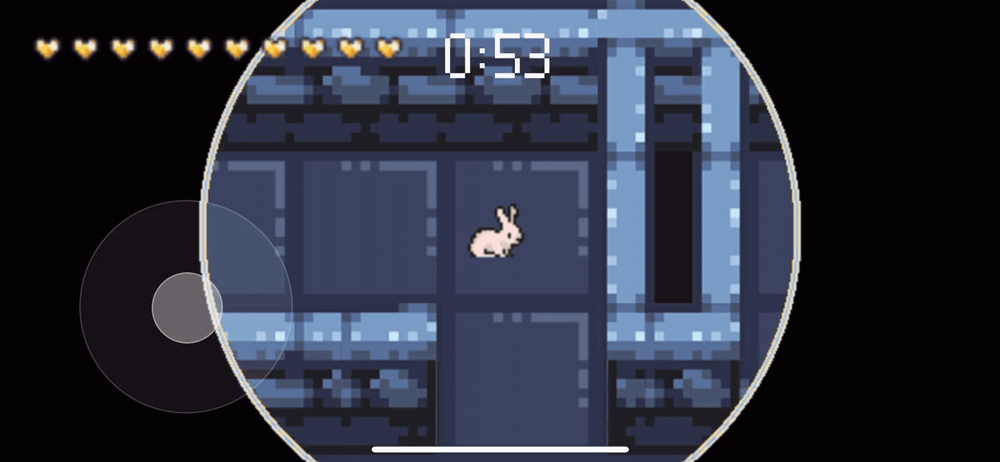 |

<br />

## 출구 힌트 & 진동 피드백 시스템

**출구에 가까워질수록 강해지는 힌트**

출구와 가까워질수록 캐릭터 머리 위의 힌트 표시 크기와 진동 강도가 단계적으로 변화합니다.  
감각적 피드백을 단서 삼아 방향을 추측하며 탐색의 긴장감을 느낄 수 있는 요소입니다.

| <div align="center">단계</div>                                                                          | <div align="center">미리보기</div>                                                           |
| ------------------------------------------------------------------------------------------------------- | -------------------------------------------------------------------------------------------- |
| <div align="center">🟢 <b>약한 단계의 힌트</b><br/><sub>가장 작은 힌트 아이콘 + 약한 진동</sub></div>   | <p align="center">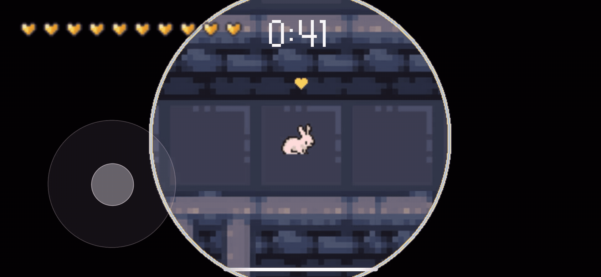</p>  |
| <div align="center">🟡 <b>중간 단계의 힌트</b><br/><sub>중간 크기의 힌트 아이콘 + 중간 진동</sub></div> | <p align="center">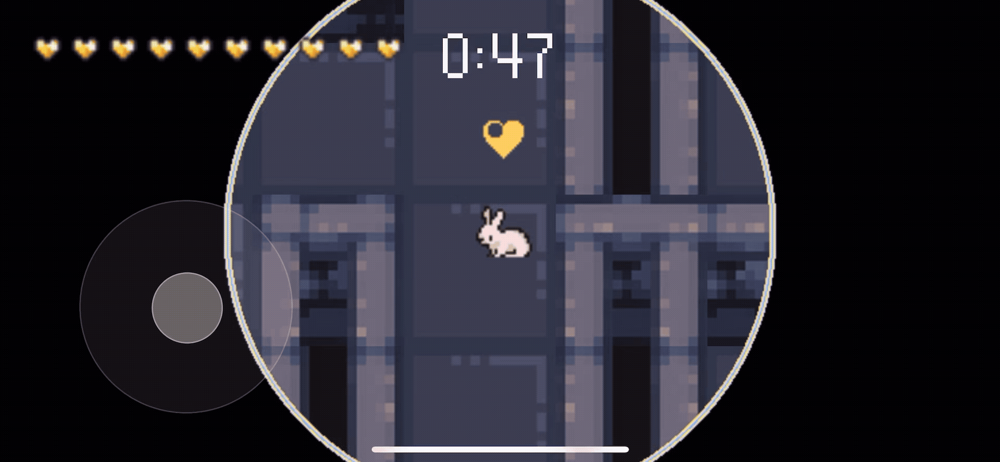</p> |
| <div align="center">🔴 <b>강한 단계의 힌트</b><br/><sub>가장 큰 힌트 아이콘 + 강한 진동</sub></div>     | <p align="center">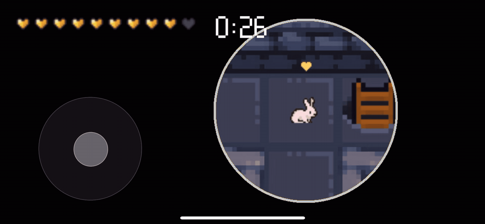</p>  |

<br />

## 스테이지 상호작용 시스템

**발판 스위치, 함정, HP로 구성된 미로**

발판 스위치를 밟아 문을 여는 등 다양한 오브젝트와의 상호작용을 통해 스테이지를 진행합니다.  
가시와 독 등 함정을 피해 탈출하는 생존형 미로 플레이를 경험할 수 있습니다.

| <div align="center">🫀 <b>함정&HP</b><br/><sub>함정 밟을 시, HP 감소</sub></div> | <div align="center">🚪 <b>발판 스위치</b><br/><sub>플레이어가 일정 시간 스위치를 밟으면 닫힌 문이 열림</sub></div></sub> |
| :------------------------------------------------------------------------------: | :----------------------------------------------------------------------------------------------------------------------: |
|     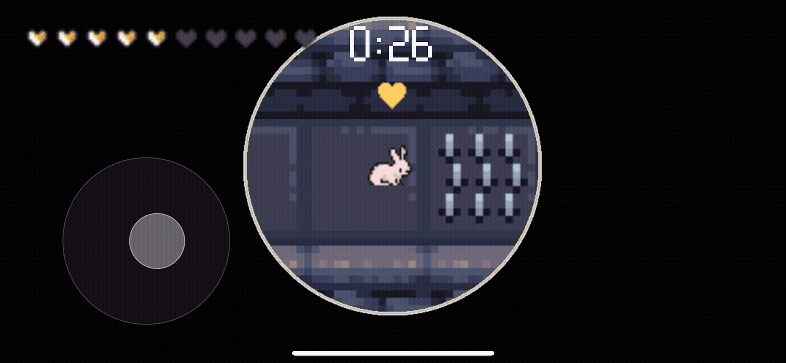     |                         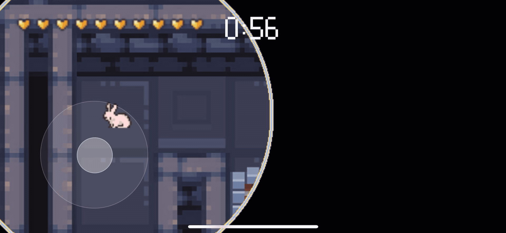                         |

<br />
<br />

# 챌린지

## 1. JSON으로 된 맵이 어떻게 실제 게임으로 바뀔까?

> 게임의 맵은 이미지가 아닌 JSON 형태의 데이터로 정의했습니다.  
> 이 데이터를 불러와 **검증 → 변환 → 초기화**하는 과정을 통해  
> 엔진이 이해하고 실행할 수 있는 실제 게임 월드로 변환되는 구조를 설계했습니다.  
> 이를 통해 스테이지를 코드 수정 없이 손쉽게 추가·수정할 수 있는 유연한 맵 로딩 시스템을 구축했습니다.

<br />

### 1-1. 맵 데이터를 JSON으로 분리한 이유

맵 데이터를 외부 파일로 분리한 이유는,  
**스테이지를 쉽게 추가·수정할 수 있는 구조를 만들기 위해서였습니다.**

이를 위해 **엔진 로직과 데이터를 분리하는 설계**가 필요했습니다.

- **엔진**: 데이터를 읽어 화면에 그리기만 담당
- **JSON 파일**: 맵의 구성 정의 (벽 위치, 출구, 플레이어 시작 위치, 버전 등)

결과적으로 **JSON 파일만 교체하면 새로운 스테이지가 즉시 반영**되는 구조를 갖출 수 있었습니다.

<br />

#### 🗂️ JSON을 선택한 이유

| 이유          | 설명                                               |
| :------------ | :------------------------------------------------- |
| **구조 표현** | 계층적 데이터를 직관적으로 표현 가능               |
| **검증 지원** | Zod 스키마를 활용한 잘못된 데이터로 인한 에러 방지 |
| **확장성**    | 파일 추가만으로도 코드 수정 없이 확장 가능         |
| **버전 관리** | Git에서 변경 이력 추적 용이                        |

<br />

### 1-2. JSON이 실제 게임 월드로 변환되는 과정

게임에서 JSON 형태의 맵 데이터를 사용하기 위해  
`1️⃣ 검증 → 2️⃣ 변환 → 3️⃣ 초기화`의 세 단계를 거치도록 설계했습니다.

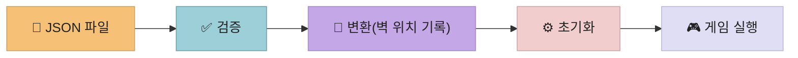

#### 1️⃣ 데이터 검증

논리적으로 잘못된 맵 데이터(예: 중복된 ID, 존재하지 않는 문을 참조하는 스위치 등)로 인한 오류를 방지하기 위해  
TypeScript 기반의 데이터 검증 라이브러리인 Zod를 활용해 구조를 검증합니다.

```typescript
const parsed = MapJsonSchema.parse(input);
```

<br />

#### 2️⃣ 맵 데이터 변환: 엔진이 해석할 수 있는 형태로 가공하기

JSON으로부터 읽어온 맵 데이터를 게임 엔진이 효율적으로 사용할 수 있도록 변환합니다.

**변환 과정에서 수행하는 주요 작업:**

- 맵 메타데이터 추출 (맵 크기, 타일 사이즈, 버전)
- 플레이어 시작 위치 좌표 변환
- 출구 위치 수집
- **충돌 가능한 타일 저장** (벽, 문)
- **위험 타일 저장** (함정)

<br />

**🚏 플레이어 좌표 변환 방법**

맵은 2차원 배열 형태로 구성되어 있으며,  
각 칸의 실제 크기(`tileSize`)를 기준으로 화면 좌표(`px`) 를 배열 좌표(tile 단위)로 변환해야 했습니다.

예를 들어, 플레이어의 실제 화면 좌표가 `x = 128px`, `y = 64px` 이고  
한 칸의 크기가 tileSize = 64px 이라면,

```typescript
const tileX = Math.floor(x / tileSize);
const tileY = Math.floor(y / tileSize);
```

계산 결과, `tileX = 2`, `tileY = 1` 로 변환됩니다.  
즉, 화면상의 픽셀 좌표를 맵 데이터의 `(행, 열)` 위치로 바꾸는 과정입니다.

이를 통해 플레이어가 맵 데이터 상의 어느 타일 위에 있는지를 파악하고,  
벽 충돌 처리나 함정 판정 등에 활용할 수 있었습니다.

<br />

**🤔 문제 상황: 2차원 배열을 매번 검색하는 비효율**

게임이 실행되는 동안, 매 프레임마다 다음과 같은 계산이 반복됩니다.

- 플레이어가 벽과 충돌하는가?
- 플레이어가 함정을 밟았는가?
- 어떤 영역에 조명을 비춰야 하는가?

이러한 판정을 수행하려면 매번 플레이어의 위치 좌표를 기준으로  
**2차원 배열(`grid`)에서 해당 타일 값을 직접 탐색**해야 했습니다.

```json
{
  "grid": [
    [1, 1, 1, 1, 1],
    [1, 0, 3, 2, 1],
    [1, 1, 1, 1, 1]
  ]
}
```

> 0: 길, 1: 벽, 2: 출구, 3: 함정

<br />

가장 직관적인 방법은 필요할 때마다 배열을 순회하며 벽을 찾는 것입니다.

```typeScript
function isWall(x, y) {
	for (let row = 0; row < grid.length; row++) {
		for (let col = 0; col < grid[row].length; col++) {
			if (grid[row][col] === 1 && col === x && row === y) {
				return true; // 2중 for문으로 배열을 순회하며 벽(1)일 시에는 true,
			}
		}
	}
	return false; // 벽(1)이 아닐 시에는 false를 반환해 벽을 찾는 구조의 예시입니다.
}
```

하지만 이 방식은 **50×50 크기의 맵이라면 최대 2,500개의 타일을 매번 검사**해야 합니다.

예를 들어, 책의 같은 페이지를 찾기 위해 매번 처음부터 넘기는 것처럼  
**게임 중 변하지 않는 정적 데이터인 맵**을 매 프레임마다 다시 확인하게 되어, 1초 동안 수천 번 이상 같은 데이터를 검사하는 비효율이 발생하게 되었습니다.

<br />

**💡 해결 방안: 한 번의 탐색 후 필요한 정보를 미리 저장하는 방식**

이 문제를 해결하기 위해, **게임 시작 시 배열을 단 한 번만 순회하며 벽이 있는 좌표만 저장하는 방식**을 도입했습니다.

```typescript
function buildSolidIndex(
  grid, // 맵 데이터 (2차원 배열)
  index, // 좌표 저장소
  targetTile, // 찾을 타일 (1 = 벽)
) {
  // 맵의 모든 행을 순회 (Y축, 세로 방향)
  for (let tileY = 0; tileY < grid.length; tileY++) {
    const row = grid[tileY]; // 현재 행

    // 행의 모든 열을 순회 (X축, 가로 방향)
    for (let tileX = 0; tileX < row.length; tileX++) {
      // 이 칸이 찾는 타일이라면?
      if (row[tileX] === targetTile) {
        index.add(tileX, tileY); // 좌표 (X, Y) 저장
      }
    }
  }
}
```

<br>

벽이 있는 좌표만 저장하는 방식을 활용해 특정 타일 좌표에 벽이 있는지 바로 조회하고,
플레이어가 가려는 위치가 벽인지 검사하는 구조로 사용할 수 있었습니다.

```typescript
// 예시: (5, 3) 위치에 벽이 있는지 확인
if (벽_목록.has(5, 3)) {
  // 벽 발견!
}
```

<br />

**⚡ 맵 데이터를 매번 탐색하는 방식 vs 처음 한 번만 탐색하고 저장해 두는 방식**

| 비교 항목              | **매번 탐색 방식**                                 | **필요한 정보만 미리 저장하는 방식**                   |
| :--------------------- | :------------------------------------------------- | :----------------------------------------------------- |
| **작동 원리**          | 매 프레임마다 2차원 배열 전체를 순회하며 벽을 찾음 | 게임 시작 시 한 번만 전체를 스캔해 벽 좌표를 미리 저장 |
| **벽 존재 확인**       | `grid[y][x]`를 매번 검사                           | `wall.has(x, y)`로 즉시 확인                           |
| **50×50 맵 기준 연산** | 최대 2,500회 탐색                                  | 1회 조회                                               |
| **특징 요약**          | 단순하지만 반복 연산이 많음                        | 초기화는 느리지만 실행 중 빠름                         |

중복 없이 값을 저장하며, 특정 값의 존재 여부를 빠르게 확인할 수 있는 `Set` 자료구조를 활용해,  
매 프레임마다 수천 번 반복되는 충돌 체크를 빠르게 처리할 수 있었습니다.

<br />

이렇게 변환된 데이터는 게임 초기화 단계에서  
플레이어, 카메라, 조명 시스템들과 결합되어 실행 가능한 게임 월드가 됩니다.

<br />

#### 3️⃣ 게임 월드 초기화

변환된 맵 데이터는 게임 중 변하지 않는 것들까지만 처리하고,  
초기화 단계에서는 변환된 정적인 맵에 **움직이고 변화하는 요소들**을 배치해  
실제로 플레이 가능한 게임 월드를 완성하도록 했습니다.

<br />

**🎭 정적 데이터 vs 동적 상태**

| 구분            | 변환 단계 (정적)    | 초기화 단계 (동적)       |
| :-------------- | :------------------ | :----------------------- |
| **데이터 특징** | 게임 중 변하지 않음 | 매 프레임 갱신됨         |
| **예시**        | 벽 위치, 출구 좌표  | 플레이어 HP, 카메라 위치 |
| **역할**        | 무대 설계도         | 무대 위의 배우들         |

> 정적 데이터와 동적 상태를 분리함으로써,  
> 한 번만 계산하면 되는 정보(맵, 벽, 출구 등)와  
> 매 프레임마다 갱신되어야 하는 정보(플레이어, 조명, 카메라 등)를  
> 서로 다른 주기로 효율적으로 관리할 수 있도록 했습니다.

<br />

#### 🚀 실행 가능한 게임 월드 생성 결과

이 과정을 통해, JSON 파일로부터 생성된 데이터가  
엔진이 이해할 수 있는 구조로 변환되고, 실행 가능한 게임 월드로 완성되었습니다.

“데이터 → 로직 → 실행”의 명확한 흐름을 갖춘 덕분에  
스테이지를 추가하거나 수정할 때마다 코드를 건드릴 필요 없이 새로운 맵을 빠르고 안정적으로 반영할 수 있게 되었습니다.

<br />
<br />

## 2. React Native만으로 어떻게 게임 엔진을 구현할 수 있을까?

> `react-native-game-engine` 같은 라이브러리가 존재하지만,  
> 외부 패키지에 의존하지 않고, React Native만으로 직접 게임 엔진을 설계해 보고자 했습니다.  
> React Native 환경 위에서 게임 루프와 시스템 아키텍처를 직접 구현하며,  
> **프레임 단위로 상태를 제어하는 방식**을 실험 했습니다.

React는 일반적으로 사용자 입력이나 상태 변화가 있을 때만 화면을 갱신하지만,  
게임은 사용자 입력이 없어도 매 순간 상태가 변해야 합니다.

이러한 한계를 해결하기 위해, React의 렌더 주기와 **분리된 자체 게임 루프**를 구축하고  
플레이어, 맵, 조명 등 모든 요소를 통합 관리하는 **월드 상태 구조**를 직접 설계했습니다.

<br />

### 2-1. React와 게임 루프의 구조적 차이

React 앱은 보통 **사용자의 입력이나 상태 변화가 발생할 때** 화면을 다시 렌더링합니다.  
하지만 제가 구현하고자 했던 게임은 **사용자의 상호 작용이 없이도** 지속적으로 화면이 렌더링 되어야 했습니다.

- 🏃‍♀️ 플레이어 캐릭터의 움직임
- ⏳ 제한 시간의 감소
- 👁️ 시간에 비례해 줄어드는 시야

이렇게 끊임없이 변하는 데이터를 React Native 안에서  
어떻게 안정적으로 관리할 수 있을지가 핵심 과제였습니다.

<br />

이를 위해 가장 먼저 시도한 방법은 `useState`로 상태를 주기적으로 업데이트하는 것이었습니다.  
하지만 **React의 업데이트 타이밍이 일정하지 않다는 점**에서 문제가 드러났습니다.

<br />

React는 이벤트 핸들러가 끝날 때까지  
여러 `setState` 호출을 한 번에 처리하는 **배칭(batching)** 방식을 사용합니다.  
이 방식은 일반적인 UI에서는 불필요한 렌더링을 줄여 효율적이지만,  
게임처럼 **프레임 단위로 일정한 시간마다 상태를 갱신해야 하는 환경**에서는 오히려 문제가 되었습니다.

React는 상태 변경을 즉시 처리하지 않기 때문에
상태 업데이트의 시점을 명확히 제어하기 어렵고, 업데이트가 React의 렌더링 타이밍에 따라 지연되거나 병합될 수 있어  
프레임 단위로 일관된 흐름을 유지하기가 어려웠습니다.

<br />

> [!WARNING]  
> 그 결과, 어떤 프레임에서는 여러 연산이 한 꺼번에 처리되고, 어떤 프레임에서는 한 템포 늦게 반영되는 등  
> **프레임 간 시간 간격이 불규칙해 지는 시각적 불안정**으로 이어졌습니다.

<br />
<br />

### 2-2. 게임 루프를 위한 상태 관리와 렌더링의 분리

저는 **게임의 실제 상태**와 **React 렌더링**을 **분리**하기로 했습니다.

React의 `useState`는 값이 바뀔 때마다 컴포넌트를 다시 렌더링합니다.  
하지만 여러 번의 setState 호출을 한 번에 처리하는 **배칭** 처리 때문에  
**매 프레임마다 정확한 타이밍에 상태를 갱신해야 하는 게임 루프에는 적절하지 않다고 생각했습니다.**

<br />

컴포넌트가 언마운트되지 않는 한 값을 계속 유지할 수 있는 useRef를 활용해  
React의 리렌더링 여부와 관계없이 게임의 상태를 연속적으로 저장하고 계산할 수 있도록 설계했습니다.

이 특성을 이용해, React의 렌더링 주기와는 별도로 움직이는 **게임 세계(World)** 를 만들기로 했습니다.

<br />

#### 🧩 구조 설계

1. 하나의 월드 객체(`worldRef`)를 `useRef`로 유지한다.
   → React가 리렌더링되어도 월드 상태는 그대로 유지됨
2. 모든 게임 로직은 이 월드 객체를 직접 수정하는 System 단위로 분리한다.
3. 브라우저가 다음 화면을 그리기 직전에 콜백 함수를 실행하도록 요청할 수 있는 `requestAnimationFrame`을 이용해
   일정한 시간 간격으로 루프를 실행하고, 모든 시스템이 동일한 시간 정보를 공유하도록 한다.

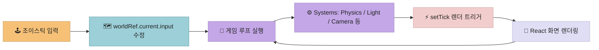

<br />

#### 🔄 게임 루프 구현

```typescript
// 1. 월드 상태를 보관하는 단일 객체
const worldRef = useRef(createWorldState({ mapJson }));

// 2. 각 시스템은 같은 시그니처를 가진 함수들
const systems = [PhysicsSystem, LightSystem, CameraSystem];
```

이 월드 객체(`worldRef.current`)에는  
플레이어 **위치, 조명 반경, 카메라 정보** 등 게임의 모든 상태가 들어 있습니다.  
React는 이 값을 상태로 관리하지 않으며, 현재 상태(`worldRef.current`)를 그리는 뷰 레이어 역할만 하고자 했습니다.

이후에는 `requestAnimationFrame`을 이용해,  
브라우저가 다음 화면을 그리기 직전에 게임 로직을 실행하는 **전용 루프**를 구성했습니다.

```typescript
function loop(now: number) {
  // 3. 마지막 프레임으로부터 시간 차이를 계산
  const delta = now - lastFrameTime.current;
  lastFrameTime.current = now;

  // 4. 모든 시스템이 동일한 시간 차이를 기준으로 월드를 수정
  for (const system of systems) {
    system(worldRef.current, { time: { delta, now } });
  }

  // 다음 루프를 예약한다
  requestAnimationFrame(loop);
}
```

<br />

#### ⏱️ 결과: 일정한 시간 축 확보

- 게임의 시간 계산과 시스템 업데이트는 React의 렌더링과는 별도의 루프에서 수행합니다.
- 따라서 React의 리렌더 타이밍에 영향을 받지 않고,
  모든 시스템이 동일한 delta를 기준으로 일관된 시간 축을 유지할 수 있었습니다.

<br />

### 2-3. 독립된 루프를 React 렌더링과 연결하기

앞서 설계한 구조에서는,  
게임의 모든 연산이 `worldRef.current` 내부에서 독립적으로 수행됩니다.  
이제 React에게 **현재 월드 상태를 화면에 렌더링**하라는 **렌더링 신호**만 최소한으로 전달해 주었습니다.

이를 위해 별도의 복잡한 상태를 만들지 않고,  
단 하나의 가벼운 숫자 상태(`tick`)를 추가해 렌더링 주기를 제어하는 스위치로 사용했습니다.

```typescript
const [tick, setTick] = useState(0);

function loop() {
  // React에게 화면 갱신 신호
  setTick((tick) => tick + 1);
}
```

이 방식으로, 게임 로직은 React의 렌더링 주기와 완전히 분리되어 독립적으로 실행되고,  
React는 화면을 갱신하는 역할만 담당할 수 있게 되었습니다.  
결과적으로 불필요한 리렌더링을 최소화하면서도,  
매 프레임의 최신 월드 상태를 안정적으로 표현할 수 있었습니다.

<br />
<br />

## 3. 지형 디자인을 알고리즘으로 자동화할 수 있을까?

> 타일 기반 지형을 디자인할 때, 벽의 형태를 직접 배치하는 과정은 반복적이고 비효율적이었습니다.  
> 이를 해결하기 위해 각 타일이 주변 상태를 계산해 스스로 형태를 결정하는 **오토타일링 시스템** 을 설계했습니다.

|                                           Before (초기 구현)                                           |                                               After (오토타일링 구현 후)                                                |
| :----------------------------------------------------------------------------------------------------: | :---------------------------------------------------------------------------------------------------------------------: |
| 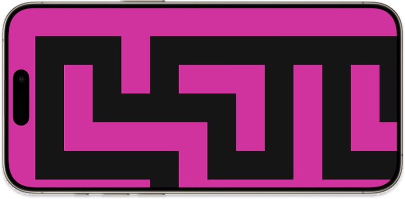<br/><p>색상으로 벽을 구분하던 구조</p> | 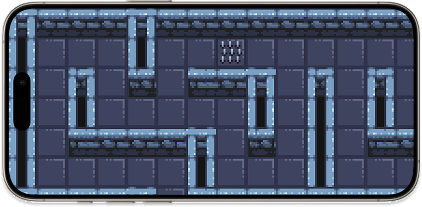 <br/><p>오토타일링으로 자동 계산된 자연스러운 벽 구조</p> |

<br />

### 3-1. 핵심 아이디어: 오토타일링

**오토타일링(Auto-Tiling)** 은 각 타일이  
주변 타일과의 관계(상·하·좌·우)를 계산하여 자신의 형태를 자동으로 결정하는 타일 배치 알고리즘입니다.

이 방식을 사용하면, **맵을 만들 때 단순히 "여기는 벽, 여기는 길, 여기는 출구" 등만 지정**하고,  
시스템이 알아서 **벽의 모서리, 교차점, 연결 부분을 자연스럽게 렌더링** 합니다.

<br />

### 3-2. 수동 타일 배치 방식의 한계

수동으로 타일을 배치하는 방식은 **시각적 일관성**과 **효율성** 두 가지의 한계가 있었습니다.

#### 🎨 문제 1: 단순 반복 배치의 한계

벽 이미지를 하나만 반복 배치하면  
모서리나 교차점처럼 **디테일이 필요한 구간까지 동일한 타일로 처리**되어  
지형이 단조롭고 부자연스러워 집니다.

결과적으로 **시각적 완성도가 떨어지고 플레이어의 몰입감 저하**로 이어질 것이라고 생각했습니다.

<br />

#### ⏱️ 문제 2: 수작업 배치의 비효율성

타일 종류를 구분해 배치하려면 **모든 위치를 일일이 지정**해야 하므로  
맵이 커질수록 작업량이 증가하고, 디자인 일관성을 유지하기 어려울 것 같다고 판단되었습니다.

<br />

#### 🗺️ 맵 데이터 구조

맵은 숫자로 이루어진 2차원 배열(`map.json`)로 정의됩니다.

```json
{
  "grid": [
    [1, 1, 1, 1, 1],
    [1, 0, 0, 0, 1],
    [1, 0, 1, 0, 1],
    [1, 0, 0, 2, 1],
    [1, 1, 1, 1, 1]
  ]
}
```

<table>
  <tr>
    <th style="text-align:center;">값</th>
    <th style="text-align:center;">의미</th>
  </tr>
  <tr>
    <td align="center"><code>0</code></td>
    <td align="center">🛣️ 길 (이동 가능)</td>
  </tr>
  <tr>
    <td align="center"><code>1</code></td>
    <td align="center">🧱 벽 (이동 불가)</td>
  </tr>
  <tr>
    <td align="center"><code>2</code></td>
    <td align="center">🚪 출구</td>
  </tr>
</table>

초기 구현에서는 이 데이터를 단순한 색상 블록으로만 표시했었습니다.  
하지만 **단순한 숫자 데이터만으로는 벽이 직선인지, 모서리인지, 십자 교차점인지 등을 표현할 수 없었습니다.**

<br />

### 3-3. 벽 형태를 자동으로 계산하는 오토타일링 로직

각 타일이 주변의 벽 배치를 확인해  
**직선, 모서리, 교차점 등 어떤 형태를 가져야 할지를 스스로 결정하도록** 구현했습니다.  
이 로직은 `1️⃣ 주변 타일 관계 계산 → 2️⃣ 벽 형태 판별 → 3️⃣ 렌더링 데이터 변환`으로 세 단계로 구성되어 있습니다.

<br />

| 주변 상태             | <div align="center">주변 3x3 상태<br>(`□`: 현재 타일, `■`: 벽, `·`: 빈 공간)</div> | 설명                                             |
| --------------------- | ---------------------------------------------------------------------------------- | ------------------------------------------------ |
| ① 수평 직선 벽        | <div align="center">`· · ·`<br>`■ □ ■`<br>`· · ·`</div>                            | 왼쪽과 오른쪽에 벽이 있고, 위와 아래는 비어 있음 |
| ② 수직 직선 벽        | <div align="center">`· ■ ·`<br>`· □ ·`<br>`· ■ ·`</div>                            | 위와 아래에 벽이 있고, 왼쪽과 오른쪽은 비어 있음 |
| ③ 오른쪽 위 모서리 벽 | <div align="center">`· · ·`<br>`■ □ ·`<br>`· ■ ·`</div>                            | 왼쪽과 아래 쪽이 벽으로 막힌 코너 형태의 벽      |
| ④ 십자 교차 벽        | <div align="center">`· ■ ·`<br>`■ □ ■`<br>`· ■ ·`</div>                            | 위, 아래, 왼쪽, 오른쪽 네 방향 모두 벽이 존재함  |

> 각 타일이 주변의 벽 배치를 확인해 자신의 형태(직선, 코너, 교차 등)를 자동으로 결정하도록 한 예시입니다.

<br />

#### 🧮 1단계: 주변 타일 관계 계산

현재 타일을 기준으로 **주변(상·하·좌·우)에 벽이 있는지를 검사**합니다.

```
return {
  north: isWall(x, y - 1),
  east: isWall(x + 1, y),
  south: isWall(x, y + 1),
  west: isWall(x - 1, y),
}
```

<br />

#### 🧱 2단계: 벽 형태 판별

이웃 관계 데이터를 바탕으로 각 타일이 어떤 형태를 가져야 하는지 판별합니다.

```
if (!neighbors.north && !neighbors.west)
  return [{ kind: "corner", direction: "top_left" }];

if (!neighbors.south)
  return [{ kind: "edge", direction: "bottom" }];
```

<br />

#### 🖼️ 3단계: 렌더링 가능한 이미지로 변환

선택된 타일 정보를 렌더링 데이터로 변환해 배열에 누적합니다.

```
renderables.push({
  key: `wall-${x}-${y}`,
  source: WALL_ASSETS.corner.top_left,
  screenX, screenY, screenW, screenH,
});
```

이후 렌더링 단계에서 해당 배열을 순회하며 각 타일 이미지를 화면에 출력합니다.

<br />

**결과**

<p align="center">
  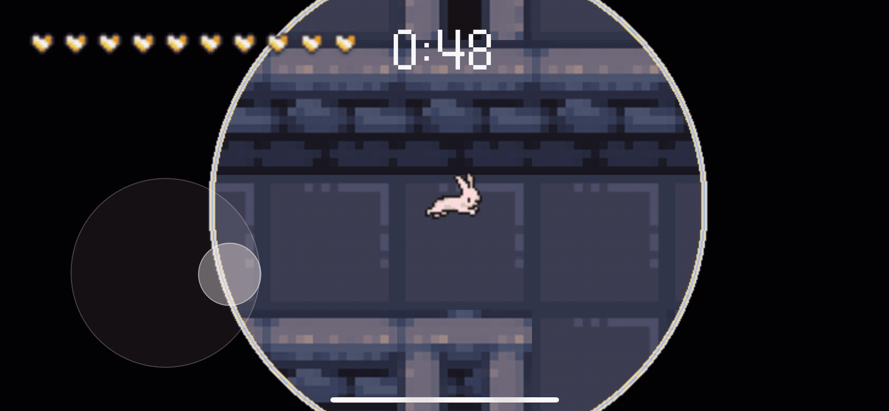
</p>

이 과정을 통해 2차원 숫자 배열로 구성된 맵 데이터만으로도  
벽이 자동으로 연결되고 자연스러운 지형이 형성되는 결과를 얻을 수 있었습니다.  
새로운 스테이지를 추가하더라도, 별도의 수작업 없이 일관된 디자인을 유지할 수 있습니다.

<br />
<br />

# 회고

Escape from Darklight는 “React 안에서 게임을 어떻게 구현할 수 있을까?”라는 호기심에서 출발한 프로젝트었습니다.

<br />

별도의 엔진 외부 패키지에 의존하지 않고, React Native 위에 직접 게임 루프와 엔진 구조를 설계했습니다.  
렌더링 주기와 분리된 커스텀 루프를 설계하고, 다양한 게임의 시스템을 직접 만들어가며  
기존 프레임워크의 제약을 넘어서기 위해 새로운 것에 도전하고 모르는 분야를 극복하는 과정이 매우 뜻깊었습니다.

프론트엔드와 백엔드를 혼자 구축하며, 초기에 세운 구조가 로직 확장 과정에서 여러 번 흔들리기도 했습니다.  
그 시행착오를 통해 유연한 설계와 명확한 책임 분리의 중요성을 절실히 깨달았습니다.  
변화 속에서 더 나은 구조를 찾아가는 과정이 큰 배움이 되었습니다.

또한 기획부터 개발, 배포까지 전 과정을 직접 경험하면서  
작은 디테일이 사용자의 몰입도와 경험에 얼마나 큰 영향을 주는지 실감할 수 있었습니다.  
그 과정을 통해 기능 구현을 넘어, 경험을 설계하는 시야를 넓힐 수 있었던 것 같습니다.

<br />

이 모든 과정은 새로운 것을 시도해 보며 직접 부딪혀보자는 마음에서 시작되었고,  
게임 개발은 처음이었지만, 생소한 개념을 공부해 보고, 엔진부터 시스템까지 직접 구현해 가며  
한계를 실험하고 사고를 확장할 수 있었던 값진 시간이었습니다.

앞으로도 익숙하지 않은 기술과 새로운 문제를 두려워하지 않고,
스스로 탐구하며 한계를 확장하는 개발자로 성장하고자 합니다.
