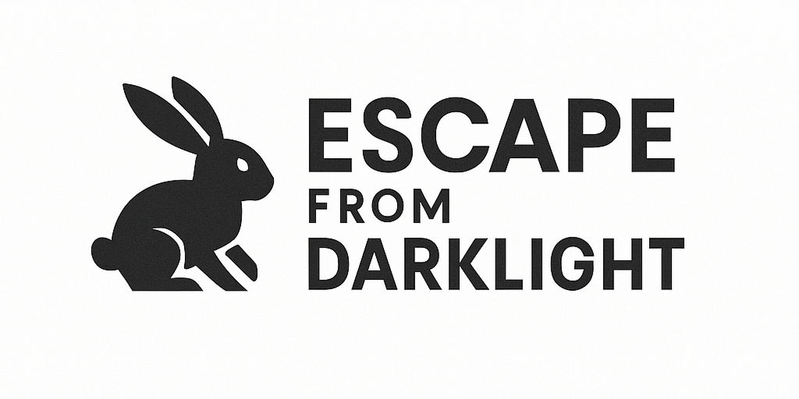

# Escape from Darklight

<p align="center">
  
</p>

<p align="center">
Escape from Darklight는 어둠 속에서 빛의 범위 안을 탐색하며 출구를 찾아 탈출하는 모바일 퍼즐 게임 어플리케이션입니다. <br />
제한된 시야와 햅틱 피드백을 활용해 장애물을 피하고, 다양한 장치를 작동시켜 스테이지를 클리어할 수 있습니다.
</p>

[🎥 유튜브 링크](링크 추가 예정)

<br />
<br />

# 목차

- [레포지토리의 구조](#레포지토리의-구조)
- [기술 스택](#기술-스택)
  - [클라이언트](#클라이언트)
  - [API 서버](#api-서버)
- [핵심 기능](#핵심-기능)
  - [시야 제한 & 조명 시스템](#시야-제한--조명-시스템)
  - [출구 힌트 & 진동 피드백 시스템](#출구-힌트--진동-피드백-시스템)
  - [스테이지 상호작용 시스템 (발판 스위치, 함정, HP)](#스테이지-상호작용-시스템-발판-스위치-함정-hp)
- [챌린지](#챌린지)
  - [1. React 안에서 게임의 엔진을 어떻게 구현할까?](#1-react-안에서-게임의-엔진을-어떻게-구현할까)
    - [문제 상황](#문제-상황)
    - [해결 방안](#해결-방안)
      - [🔴 첫 번째 접근: setInterval 기반 루프](#-첫-번째-접근-setinterval-기반-루프)
      - [🟢 두 번째 접근: requestAnimationFrame 기반 루프](#-두-번째-접근-requestanimationframe-기반-루프)
  - [2. 맵을 어떻게 자동으로 꾸밀 수 있을까?](#2-맵을-어떻게-자동으로-꾸밀-수-있을까)
    - [문제 상황](#문제-상황-1)
    - [해결 방안](#해결-방안-1)
      - [🧮 주변 타일 관계 계산](#-주변-타일-관계-계산)
      - [🧱 벽 형태 자동 판별](#-벽-형태-자동-판별)
      - [🖼️ 렌더링 가능한 이미지로 변환](#-렌더링-가능한-이미지로-변환)
- [회고](#회고)

<br />
<br />

# 레포지토리의 구조

이 프로젝트는 **서버(api)** 와 **클라이언트(mobile)** 로 구성된 모노레포입니다.  
서버는 데이터 관리 및 API를, 클라이언트는 게임 로직과 UI를 담당합니다.

```
apps/
├── api/ # 백엔드 API 서버
│ └── src/ # API 라우팅 및 비즈니스 로직
│
└── mobile/             # 모바일 게임 클라이언트
    └── src/
        ├── assets/     # 이미지, 사운드, 맵 JSON 등 정적 리소스
        ├── components/ # 공통 UI 컴포넌트
        ├── constants/  # 상수 정의
        ├── engine/     # 게임의 코어 엔진 및 인게임 로직
        ├── hooks/      # 커스텀 훅 모음
        ├── lib/        # 도메인 유틸 함수
        ├── screens/    # 화면 단위 컴포넌트 (메인, 스테이지, 로딩 등)
        ├── store/      # 전역 상태 관리 (Zustand 기반)
        ├── types/      # 공통 타입 정의
        └── utils/      # 공통 유틸 함수
```

<br />
<br />

# 기술 스택

## 클라이언트


## API 서버


<br />
<br />

# 핵심 기능

## 시야 제한 & 조명 시스템

<p align="center">
  
</p>

플레이어 주변만 밝히는 조명 효과를 통해 어둠 속 탐색의 긴장감을 구현했습니다.  
남은 제한 시간 비율에 따라 시야 반경이 점점 줄어들며,  
플레이어는 점점 더 좁아진 시야 속에서 미로를 탈출해야 합니다.

<br />

## 출구 힌트 & 진동 피드백 시스템

<table>
  <tr>
    <td align="center">
      <br/>
      <sub>Light Hint</sub>
    </td>
    <td align="center">
      <br/>
      <sub>Medium Hint</sub>
    </td>
    <td align="center">
      <br/>
      <sub>Strong Hint</sub>
    </td>
  </tr>
</table>

출구와 가까워질수록 캐릭터 머리 위의 힌트 표시 크기와 진동 강도가 단계적으로 변화합니다.  
감각적 피드백을 단서 삼아 방향을 추측하며 탐색의 긴장감을 느낄 수 있는 요소입니다.

<br />

## 스테이지 상호작용 시스템 (발판 스위치, 함정, HP)

<table>
  <tr>
    <td align="center">
      <br/>
      <sub>함정 & HP</sub>
    </td>
    <td align="center">
      <br/>
      <sub>발판 스위치</sub>
    </td>
  </tr>
</table>

발판 스위치를 밟아 문을 여는 등 다양한 오브젝트와의 상호작용을 통해 스테이지를 진행합니다.  
가시와 독 등 함정을 피해 탈출하는 생존형 퍼즐 플레이를 경험할 수 있습니다.

<br />
<br />

# 챌린지

## 1. React 안에서 게임의 엔진을 어떻게 구현할까?

React Native + Expo 환경에서 캐릭터, 조명, 카메라, 충돌 등  
다양한 시스템이 동시에 작동하는 실시간 게임을 구현하고자 했습니다.

### 1-1. 문제 상황

하지만 React는 주로 사용자 입력이나 상태 변화가 발생했을 때 컴포넌트를 다시 렌더링하는 구조입니다.  
이로 인해 **사용자 입력이 없어도 지속적으로 갱신되어야 하는 프레임 단위 로직**을 안정적으로 처리하기 어려웠습니다.

매 프레임마다 React가 계속 리렌더링을 유도하면서, UI 트리 재계산이 반복적으로 발생했고,  
불필요한 연산 낭비와 FPS 저하로 이어졌습니다.

<br />

> 🎮 게임에서는 각 프레임 간 시간 간격(Δt, delta time)이 일정해야 움직임이 자연스럽게 표현됩니다.

하지만 **React의 렌더링 주기가 불규칙하게 동작**하면서 프레임 간 간격이 매번 달라져
캐릭터 움직임이 끊기거나 버벅이는 현상이 발생했습니다.

<br />

React의 렌더링은 **상태 변화가 있을 때만 수행**되므로,  
프레임마다 **물리·조명·애니메이션을 일정한 간격으로 갱신해야 하는 게임 구조**와는 맞지 않다고 생각이 들었습니다.  
이에 렌더 흐름과는 분리된 독립적인 게임 루프 구조가 필요했습니다.

<br>

### 1-2. 해결 방안

#### 🔴 첫 번째 접근: `setInterval` 기반 루프

초기에는 `setInterval()`을 사용해 일정 간격으로 게임 상태를 갱신하는 방식을 시도했습니다.  
하지만 이 방식은 JavaScript 실행 타이밍이 실제 화면 렌더링과 동기화되지 않아,  
프레임 간 간격이 불규칙해지고 움직임이 끊기는 문제가 발생했습니다.

<br>

#### 🟢 두 번째 접근: `requestAnimationFrame()` 기반 루프

이 문제를 해결하기 위해 `requestAnimationFrame()` 기반의 루프 구조를 도입했습니다.  
이 API는 다음 화면이 그려지기 직전에 콜백을 실행하며, 디스플레이의 새로고침 주기에 맞춰 호출됩니다.  
즉, 화면 렌더링과 동기화된 자연스럽고 안정적인 프레임 갱신이 가능할 것이라고 예상했습니다.

<br>

이 매커니즘을 바탕으로, React의 렌더링 사이클과는 독립적으로,
매 프레임마다 물리·조명·애니메이션 등을 갱신할 수 있는 커스텀 훅 `useGameLoop`를 설계했습니다.

```
const loop = useCallback((now: number) => {
  const delta = now - (lastFrameTime.current ?? now);
  lastFrameTime.current = now;

  for (const system of systems) {
    system(worldStateRef.current, { time: { delta, now } });
  }

  rafId.current = requestAnimationFrame(loop);
}, [systems]);
```

`useRef`를 활용해 게임 상태(WorldState)를 React의 렌더링 사이클과 분리함으로써,  
React는 UI 렌더링만 담당하고, 루프는 게임의 논리만 다루는 구조를 확립할 수 있었습니다.

<br>
<br>

## 2. 맵을 어떻게 자동으로 꾸밀 수 있을까?

맵은 단순히 숫자로 구성된 `map.json` 파일의 2차원 배열로 구성됩니다.  
`0`은 바닥, `1`은 벽을 의미하며, 초기 구현에서는 색상 블록으로만 표시되는 단순한 격자(grid) 형태였습니다.

<p align="center">
  
</p>

단순한 색상 격자 대신, 실제 게임처럼 시각적 완성도를 높이기 위해  
벽과 바닥 타일 디자인을 적용하고자 했습니다.

<br />

### 2-1. 문제 상황

벽 이미지를 하나만 반복 배치하면 모서리나 교차점처럼 디테일이 필요한 구간까지 동일한 타일로 처리되어 세부 구간의 표현이 단조로워지고,
타일 종류를 구분해 배치하려면 수작업이 불가피했습니다.

결과적으로 두 가지 방식 모두 스테이지가 확장 시 효율성과 유지보수성이 떨어지는 구조라고 판단했습니다.

<br />

### 2-2. 해결 방안

> 각 타일이 주변과 어떤 관계에 있는지를 계산하면,  
> 사람이 일일이 배치하지 않아도 벽의 모양을 자동으로 정할 수 있지 않을까?

이 아이디어를 바탕으로,
각 타일이 주변 타일과 맺는 관계(상·하·좌·우·대각선)를 계산하여
벽의 형태를 자동으로 결정하는 오토타일링(Auto-Tiling) 시스템을 구현했습니다.

<br />

#### 🧮 주변 타일 관계 계산

벽의 형태를 판별하기 위해,  
먼저 현재 타일을 기준으로 주변 8방향(상·하·좌·우 + 대각선)에 벽이 있는지를 검사하는 함수를 구현했습니다.  
이틀 통해 각 타일이 주변과 어떤 연결 관계를 맺고 있는지 정보를 얻을 수 있습니다.

```
return {
  north: isWall(x, y - 1),
  east:  isWall(x + 1, y),
  south: isWall(x, y + 1),
  west:  isWall(x - 1, y),
  ...
}
```

<br />

#### 🧱 벽 형태 자동 판별

이후 이웃 관계 데이터를 바탕으로 각 타일이 직선, 모서리, 교차점 중 어떤 형태를 가져야 하는지를 판별하는 로직을 작성했습니다.

```
if (!neighbors.north && !neighbors.west)
  return [{ kind: "corner", direction: "top_left" }];

if (!neighbors.south)
  return [{ kind: "edge", direction: "bottom" }];
```

<br />

#### 🖼️ 렌더링 가능한 이미지로 변환

마지막으로, 선택된 타일 정보를 렌더링 가능한 데이터로 변환해 `renderables` 배열에 누적했습니다.

```
renderables.push({
  key: `wall-${x}-${y}`,
  source: WALL_ASSETS.corner.top_left,
  screenX, screenY, screenW, screenH,
});
```

이후 렌더링 단계에서는 해당 배열을 map으로 순회하며 각 타일 이미지를 화면에 출력했습니다.

<br />

<p align="center">
  
</p>

이 과정을 통해 2차원 숫자 배열로 구성된 맵 데이터(`map.json`)만으로도  
벽이 자동으로 연결되고 자연스러운 지형이 형성되는 결과를 얻을 수 있었습니다.  
새로운 스테이지를 추가하더라도, 별도의 수작업 없이 일관된 디자인을 유지할 수 있습니다.

<br />
<br />

# 보완 계획

# 회고

Escape from Darklight는 “React 안에서 게임을 어떻게 구현할 수 있을까?”라는 호기심에서 출발한 프로젝트었습니다.

<br />

렌더링 사이클과 분리된 커스텀 루프를 설계하고, 조명·충돌·시야 제한 같은 시스템을 직접 만들어가며 기존 프레임워크의 제약을 넘어서기 위해 새로운 것에 도전하고 모르는 분야를 극복하는 과정이 매우 뜻깊었습니다.

프론트엔드와 백엔드를 혼자 구축하며, 초기에 세운 구조가 로직 확장 과정에서 여러 번 흔들리기도 했습니다.  
그 시행착오를 통해 유연한 설계와 명확한 책임 분리의 중요성을 절실히 깨달았습니다.  
변화 속에서 더 나은 구조를 찾아가는 과정이 큰 배움이 되었습니다.

또한 기획부터 개발까지 전 과정을 직접 경험하면서
작은 디테일이 사용자의 몰입도와 경험에 얼마나 큰 영향을 주는지 실감할 수 있었습니다.  
결국 중요한 건 기능이 아니라, 그걸 통해 사용자가 어떤 경험을 하게 되는가였습니다.

<br />

이 모든 과정은 주저하기보다 직접 부딪혀보자는 마음에서 시작되었고,  
게임 개발은 처음이었지만, 익숙하지 않은 기술에 도전하면서 한계를 실험하고 사고를 확장한 값진 시간이었습니다.

앞으로도 익숙하지 않은 기술과 새로운 문제를 두려워하지 않고,
스스로 탐구하며 한계를 확장하는 개발자로 성장하고자 합니다.
